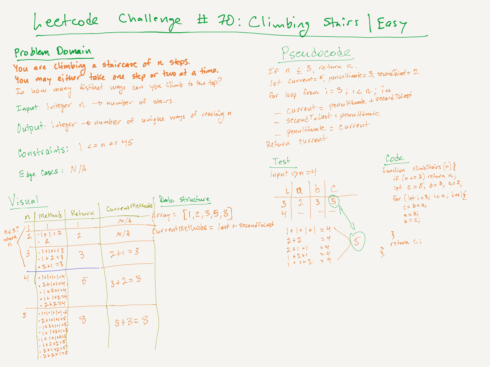

# LeetCode Challenge #70: Climbing Stairs | Rating: Easy

## Task

You are climbing a staircase. It takes n steps to reach the top.

Each time you can either climb 1 or 2 steps. In how many distinct ways can you climb to the top?

## Example 1

Input: n = 2  
Output: 2  
Explanation: There are two ways to climb to the top.

1. 1 step + 1 step
2. 2 steps

## Example 2

Input: n = 3  
Output: 3  
Explanation: There are three ways to climb to the top.

1. 1 step + 1 step + 1 step
2. 1 step + 2 steps
3. 2 steps + 1 step

## Constraints

- 1 <= n <= 45

## Whiteboard

## Notes

- I found this approach posted by niits in the solutions section on LeetCode, but I put together my own whiteboard of the solution.
- The solution is O(n) for time, because of the for-loop, but O(1) for space, because a finite number of variables are created.
