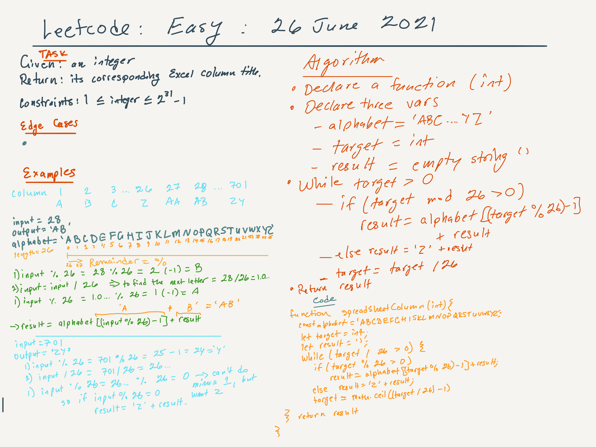

# Leetcode | Excel Spreadsheet Column Finder | 26 June 2021 | Rating: Easy

## Task

Given an integer columnNumber, return its corresponding column title as it appears in an Excel sheet.

## Constraints

1 <= columnNumber <= 231 - 1

## Examples

> Ex. 1:
    Input: columnNumber = 1
    Output: "A"
> Ex. 2:
    Input: columnNumber = 28
    Output: "AB"
> Ex. 3:
    Input: columnNumber = 701
    Output: "ZY"
> Ex. 4:
    Input: columnNumber = 2147483647
    Output: "FXSHRXW"

## Notes

The [solution](https://leetcode.com/problems/excel-sheet-column-title/discuss/1291476/JavaScript-Solution-without-recursion) here was written by Dina Ayoub and posted in the discussion tab for this problem on Leetcode.

## 
