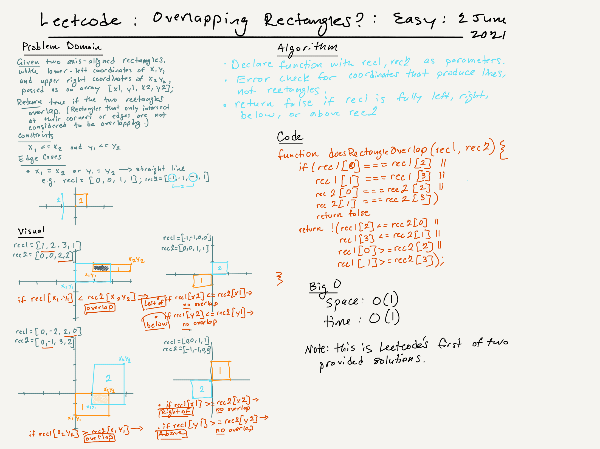

# Leetcode Challenges Rated Easy | Rectangle Overlap

## Task 

An axis-aligned rectangle is represented as a list [x1, y1, x2, y2], where (x1, y1) is the coordinate of its bottom-left corner, and (x2, y2) is the coordinate of its top-right corner. Its top and bottom edges are parallel to the X-axis, and its left and right edges are parallel to the Y-axis.

Two rectangles overlap if the area of their intersection is positive. Two rectangles that only touch at the corner or edges do not overlap.

Given two axis-aligned rectangles rec1 and rec2, return true if they overlap; otherwise, return false.

### Example 1

Input: rec1 = [0,0,2,2], rec2 = [1,1,3,3]
Output: true

### Example 2

Input: rec1 = [0,0,1,1], rec2 = [1,0,2,1]
Output: false

### Example 3

Input: rec1 = [0,0,1,1], rec2 = [2,2,3,3]
Output: false

### Constraints

rect1.length == 4
rect2.length == 4
-10^9 <= rec1[i], rec2[i] <= 10^9
rec1[0] <= rec1[2] and rec1[1] <= rec1[3]
rec2[0] <= rec2[2] and rec2[1] <= rec2[3]

### Sources

The solution to this problem was provided by Leetcode as one of two, this one using the relative positions of each rectangle to determine whether rec1 is fully left of, right of, below, or above rec2. (The other solution compares the areas of the rectangles and is also included in the code). 

### 
