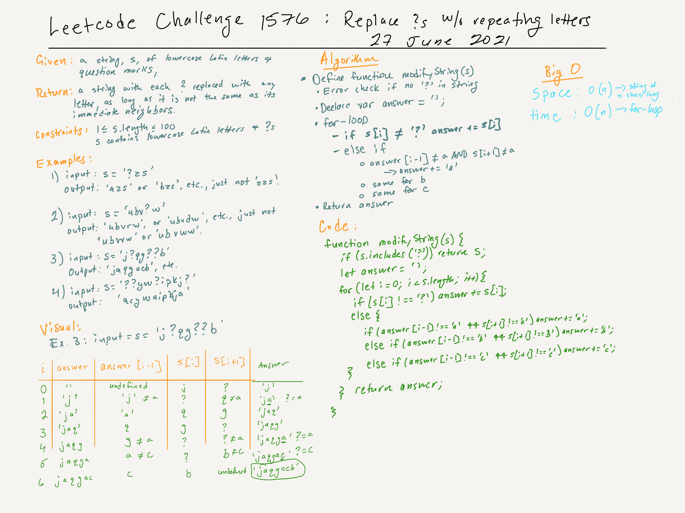

# Leetcode Challenge 1576. Replace All ?'s to Avoid Consecutive Repeating Characters | 27 June 2021 | Rating: Easy

## Task

Given a string `s` containing only lowercase Latin letters and the '?' symbol, convert all the question makrs into lowercase letters such that the final string does not contain any consecutive characters that repeat. You can modify only the non question marks.

It is guaranteed that there are no consecutive repeating characters in the given string except for '?'.

Return the final string after all the conversions (possibly zero) have been made. If there is more than one solution, return any of them. It can be shown that an answer is always possible with the given constraints.

## Constraints

- 1 <= s.length <= 100
- `s` contains only lowercase Latin letters and question marks.

## Example 1

> Input: s = "?zs"  
Output: "azs"  
Explanation: There are 25 solutions for this problem. From "azs" to "yzs", all are valid. Only "z" is an invalid modification as the string will consist of consecutive repeating characters in "zzs".

## Example 2

> Input: s = "ubv?w"  
Output: "ubvaw"  
Explanation: There are 24 solutions for this problem. Only "v" and "w" are invalid modifications as the strings will consist of consecutive repeating characters in "ubvvw" and "ubvww".

## Example 3

> Input: s = "j?qg??b"  
Output: "jaqgacb"

## Example 4

>Input: s = "??yw?ipkj?"  
Output: "acywaipkja"

## Big O

- Time: O(n) because of the for-loop: 84 ms, faster than 88.48% of JavaScript online submissions.
- Memory: O(1): 40.3 MB, less than 29.03% of JavaScript online submissions.

## 
