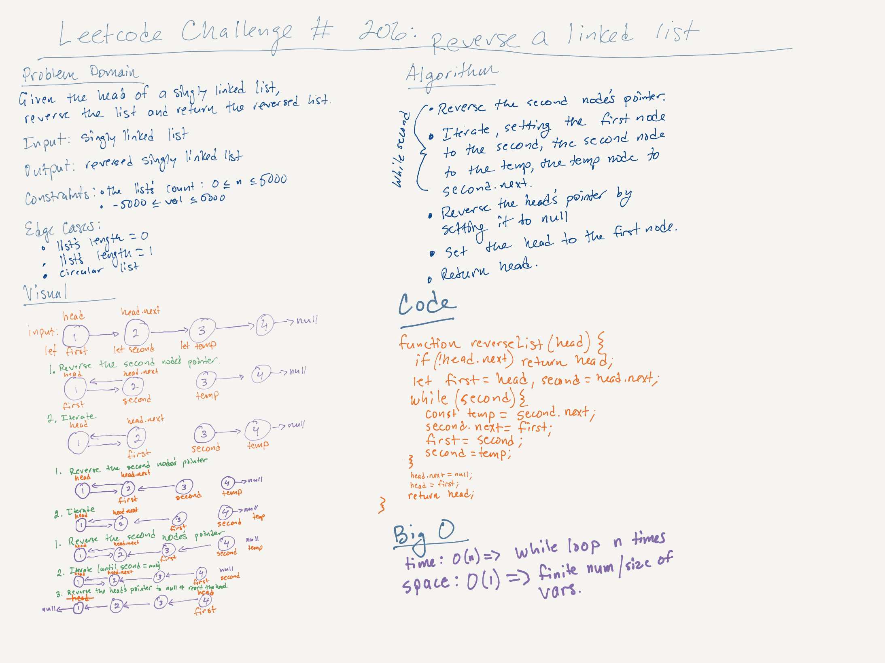

# LeetCode Challenge #206: Reverse a Linked List | Rating: Easy

## Task

Given the head of a singly linked list, reverse the list, and return the reversed list.

## Example 1

Input: head = [1,2,3,4,5]  
Output: [5,4,3,2,1]

## Example 2

Input: head = [1,2]  
Output: [2,1]

## Example 3

Input: head = []  
Output: []

## Constraints

- The number of nodes in the list is the range [0, 5000].
- -5000 <= Node.val <= 5000

## Notes

- I got help with this task from the "Master the Coding Interview: Data Structures + Algorithms" on Udemy.
- To help me understand the concept, I created the following whiteboard.
- Time complexity is O(n), n being the number of times that the while loop runs.
- Space complexity is O(1), because memory is added to a finite number of times.
- This solution is in the 97th percentile of all LeetCode solutions for runtime.

## Follow-up Task

A linked list can be reversed either iteratively or recursively. Can you implement both?

## Notes on the Follow-up Task

- I got this algorithm from Claude.ai, which also suggested adding the console logs to assist in understanding the flow of the stacks.
- The hardest part to understand--and I can't say I fully understand it yet--is the role that returning the last node plays in the code.
