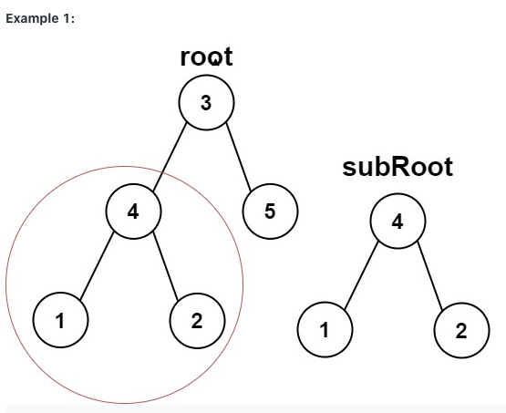
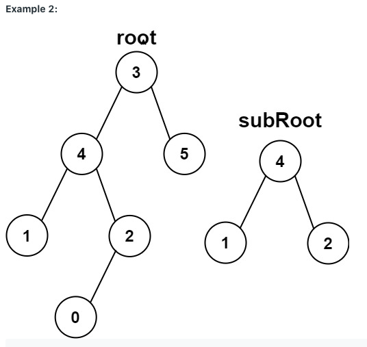
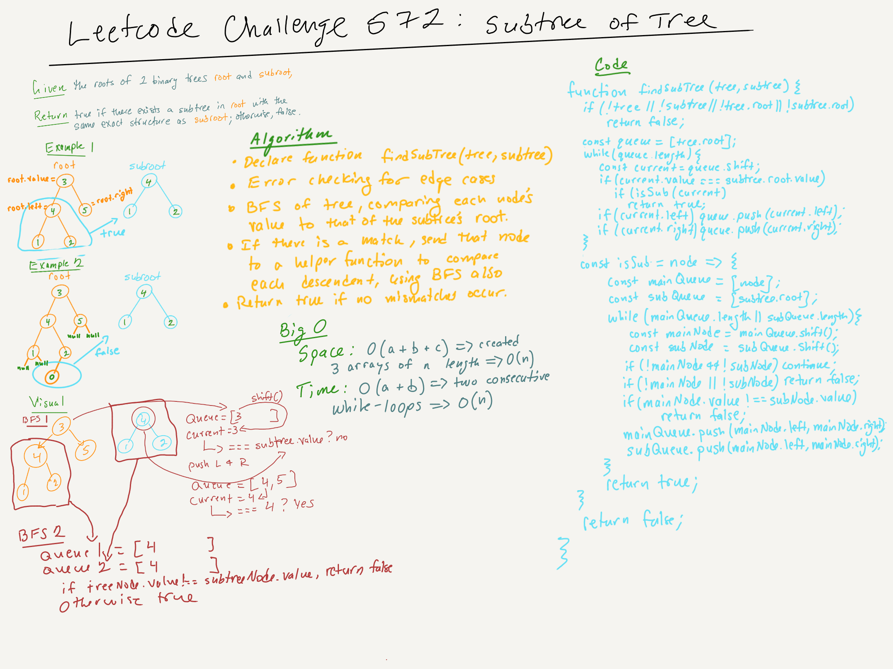

# Leetcode Challenge 572: Subtree of Another Tree | Rating: Easy

## Task

Given the roots of two binary trees `root` and `subRoot`, return `true` if there is a subtree of `root` with the same structure and node values of `subRoot`; and `false` otherwise.

A subtree of a binary tree tree is a tree that consists of a node in the tree and all of this node's descendants. The tree tree could also be considered as a subtree of itself.

## Example 1

Input: root = [3,4,5,1,2], subRoot = [4,1,2] (Warning: not arrays.)
Output: true

## Example 2

Input: root = [3,4,5,1,2,null,null,null,null,0], subRoot = [4,1,2] (Warning: not arrays.)
Output: false

## Notes on Solutions

### Solution 1 | BFS and Arrays

This is my soluiton and, while it's inelegant, it works, and I'm proud of that. It uses a breadth-first search algorithm to find a match and a preOrder method that returns an array to compare the two subtrees at index of i, returning false if an inequality is encountered in the loop and true otherwise.

- Space: O(a + b), because of the creation of the tree and subtree pre-ordered arrays.
- Time: O(a + b), because of the two consecutive while loops.j

### Solution 2 | [Breadth-First](https://leetcode.com/problems/subtree-of-another-tree/discuss/1230961/JavaScript-BFS-Solution)

This solution, which I've edited here for my purposes--including breaking it into three separate functions--was posted on the Leetcode discussion board for this challenge by "stevenwonlee". I reverse-engineered the whiteboard, so to speak, from the code while working to understand the approach thoroughly.

- Space: O(a + b + c), because of the three queues created.
- Time: O(a + b), because of the two, consecutive while-loops.

### Solution 3 | [Recursion]()
