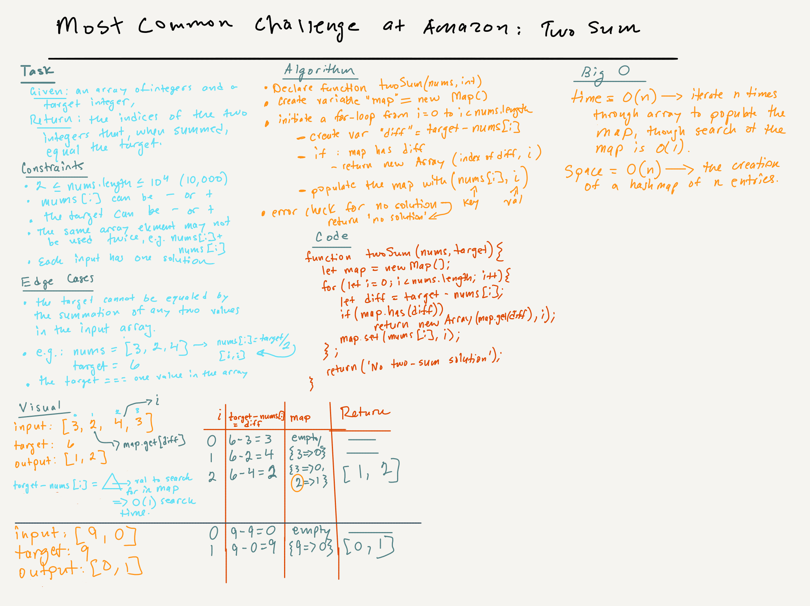

# Leetcode | Two Sums | Easy

## Task

Given an array of integers nums and an integer target, return indices of the two numbers such that they add up to target.

You may assume that each input would have exactly one solution, and you may not use the same element twice.

You can return the answer in any order.

### Example 1

Input: nums = [2,7,11,15], target = 9
Output: [0,1]
Output: Because nums[0] + nums[1] == 9, we return [0, 1].

### Example 2

Input: nums = [3,2,4], target = 6
Output: [1,2]

### Example 3

Input: nums = [3,3], target = 6
Output: [0,1]

### Constraints

- 2 <= nums.length <= 104
- -109 <= nums[i] <= 109
- -109 <= target <= 109
- Only one valid answer exists.

### 

### Notes and sources

There are two solutions in this js file, one is mine and the other is Leetcode's, which is much, much more elegant, though no faster or space-sensitive than mine. Both work. The whiteboard reflects Leetcode's solution.
