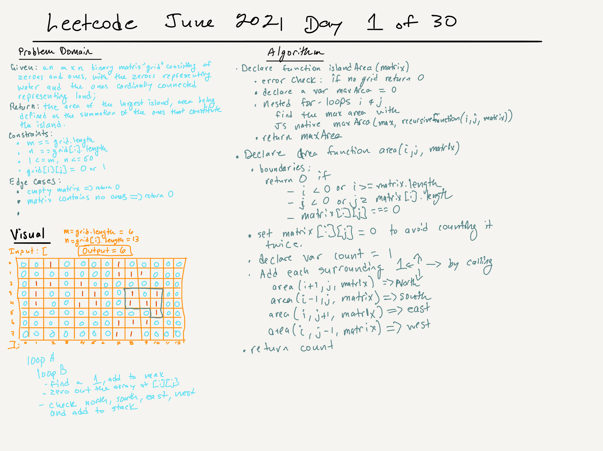

# Leetcode | 30 Days of Code Challenges in June 2021 | Day 1 | Find the Max Area of an "Island" of Ones in a Matrix

## Task

Given an m x n binary matrix, called "grid", consisting of zeroes (representing water) and ones (representing land)--with islands being defined as ones connected horizontally and/or vertically, but not diagonally--return the area of the largest island, the area being the summation of the ones that constitute the island. If there is no island, return 0.

Assume that all four edges of the grid are surrounded by water.

## Notes

This solution (see its source, below) uses nested for-loops to traverse the matrix's rows and columns in search of its islands (ones) and recursion to generate a stack of horizontally and vertically connected ones, which it sums as it pops each function off the stack, returning a counter to the original function, which returns the area of the largest "island."

## Sources

This solution was presented on [YouTube](https://www.youtube.com/watch?v=W8VuDt0eb5c) by Kevin Naughton Jr.

## 
