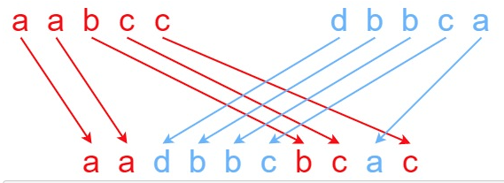

# Leetcode | 30 Days of Code Challenges in June 2021 | Day 2 | Interleaving Strings (Medium)

## Task

Given strings s1, s2, and s3, find whether s3 is formed by an interleaving of s1 and s2.

An interleaving of two strings s and t is a configuration where they are divided into non-empty substrings such that:

* s = s1 + s2 + ... + s_n
* t = t1 + t2 + ... + t_m  
* |n - m| <= 1  
* The interleaving is s1 + t1 + s2 + t2 + s3 + t3 + ... or t1 + s1 + t2 + s2 + t3 + s3 + ...

(Note: a + b is the concatenation of strings a and b.)

## Constraints

> 0 <= s1.length, s2.length <= 100  
0 <= s3.length <= 200  
s1, s2, and s3 consist of lowercase English letters.  

### Example 1

Input: s1 = "aabcc", s2 = "dbbca", s3 = "aadbbcbcac"

Output: true

### Example 2

Input: s1 = "aabcc", s2 = "dbbca", s3 = "aadbbbaccc"

Output: false

### Example 3

Input: s1 = "", s2 = "", s3 = ""

Output: true

Stretch Goal: solve the problem using O(s2.length) space.

### Big O

Space complexity: \mathcal{O}(m \cdot n)O(m⋅n) to keep double array memo.

* Space: O(1) for the variable created to hold the answer.

* Time: O(m * n), m = s1.length, n = s2.length

### 

## Sources

This one-function solution is based on that of Leetcode's approach 2 of four. While the two-function leetcode solution had a memoization feature that maintained a record of which letters had been visited, stored in a 2d array, it turns out that that feature was unnecessary for this challenge, reducing big O for space from O(m * n) to O(1). The solution, as presented here, passed all 104 tests without the memoization feature.
