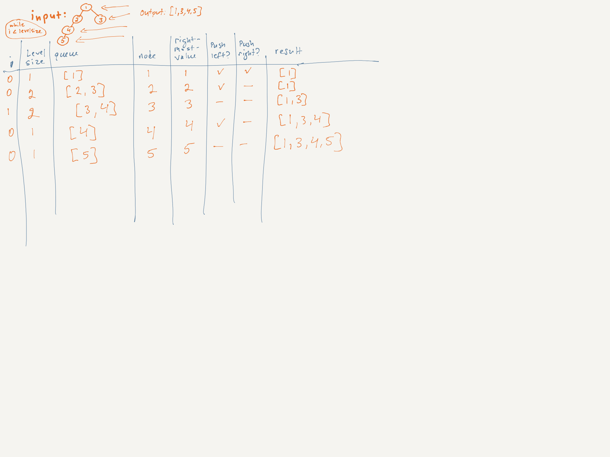

# LeetCode Challenge #199: Binary Tree Right Side View | Rating: Medium

## Task

Given the root of a binary tree, imagine yourself standing on the right side of it, return the values of the nodes you can see ordered from top to bottom.

## Example 1

Input: root = [1,2,3,null,5,null,4]  
Output: [1,3,4]  
Explanation:

## Example 2

Input: root = [1,2,3,4,null,null,null,5]  
Output: [1,3,4,5]  
Explanation:

## Example 3

Input: root = [1,null,3]  
Output: [1,3]

## Example 4

Input: root = []  
Output: []

## Constraints

- The number of nodes in the tree is in the range [0, 100].
- -100 <= Node.val <= 100

## Big O

1. BFS

    - Time: O(n), where n is the number of nodes with each node being visited once.
    - Space: O(n), because the output array stores at most n/2 values, with the divisor being considered negligible when the input is large.

2. DFS

    - Time: O(n), where n is the number of nodes with each node being visited once.
    - Space: O(h), where h is the height of the tree. (In an unbalanced tree, h may equal n.)

3. Summary

    - Balanced Trees: DFS is typically more space-efficient.
    - Unbalanced Trees: Both have similar space usage at O(n).
    - Both have the same time complexity of  O(n).
    - BFS lends itself naturally to this problem, which requires a review of the nodes at each level.

## Whiteboard

## Notes

The idea is to traverse the binary tree level by level and always take the rightmost node from each level.

THere are two possible approaches:

1. Breadth-First Search (BFS)

    - Use a queue to perform a level-order traversal.
    - At each level, capture the last node (rightmost node) in that level.

2. Depth-First Search (DFS)

    - Use recursion to traverse the tree, keeping track of the depth.
    - At each depth, add the first node encountered (which will be the rightmost node at that depth).
