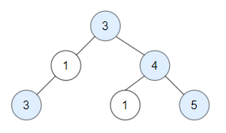
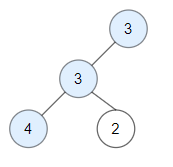
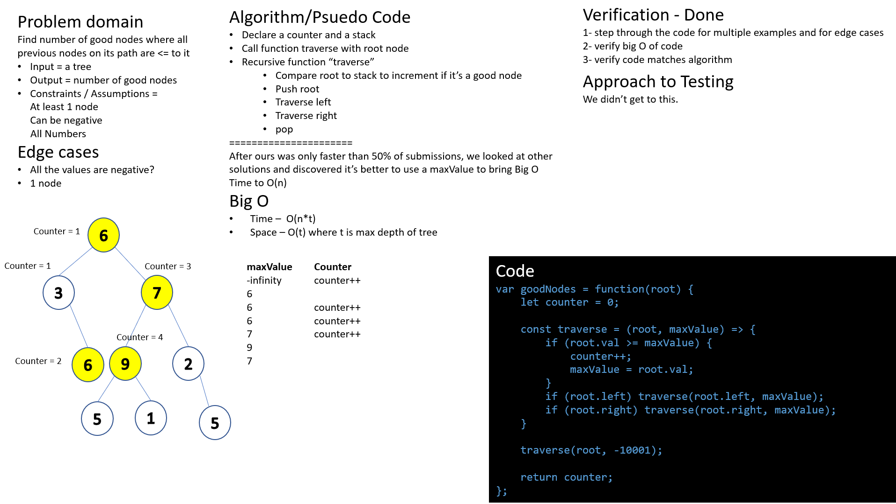

# Leetcode Challenge 1448: Find the Good Nodes in a Binary Tree | Rating: Medium

## Task

Given a binary tree root, a node X in the tree is named good if in the path from root to X there are no nodes with a value greater than X.

Return the number of good nodes in the binary tree.

## Example 1

Input: root = [3,1,4,3,null,1,5]
Output: 4
Explanation: Nodes in blue are good.
Root Node (3) is always a good node.
Node 4 -> (3,4) is the maximum value in the path starting from the root.
Node 5 -> (3,4,5) is the maximum value in the path
Node 3 -> (3,1,3) is the maximum value in the path.

## Example 2

Input: root = [3,3,null,4,2]
Output: 3
Explanation: Node 2 -> (3, 3, 2) is not good, because "3" is higher than it.

## Example 3

Input: root = [1]
Output: 1
Explanation: Root is considered as good.

## Notes on Solutions

- It uses a `maxValue` variable to keep track of the maximum value as it recurses depth first through each branch, or path, of the binary tree.

- Big 0
  - Space: O(t) where t is the maximum depth of the tree.
  - Time: O(n*t) where "n" is the number of nodes in the tree.

## 
  