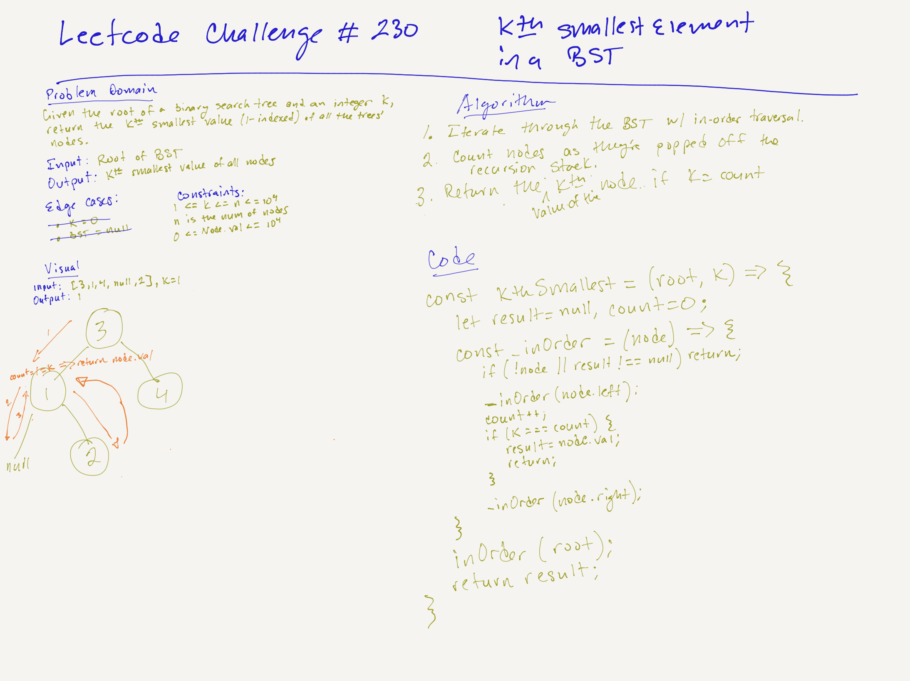

# LeetCode Challenge #230: Kth Smallest Element in a BST | Rating: Medium

## Task

Given the root of a binary search tree, and an integer k, return the kth smallest value (1-indexed) of all the values of the nodes in the tree.

## Example 1

Input: root = [3,1,4,null,2], k = 1  
Output: 1

## Example 2

Input: root = [5,3,6,2,4,null,null,1], k = 3  
Output: 3

## Constraints

- The number of nodes in the tree is n.
- 1 <= k <= n <= 104
- 0 <= Node.val <= 104

## Big O

- Time Complexity: O(h + k), where h is the height of the tree and k is the number of nodes to be visited. In the worst case (unbalanced tree), this is O(n). For a balanced tree, h is O(log n).
- Space Complexity: O(h), due to the recursive-call stack.

## Whiteboard

## Follow-up Task

If the BST is modified often (i.e., we can do insert and delete operations) and you need to find the kth smallest frequently, how would you optimize?

- If the BST is modified frequently with insert and delete operations, and you often need to find the kth smallest element, the standard BST approach becomes inefficient due to repeated traversals. To optimize for these scenarios, you can augment the BST by adding node size information.

- So, augmented the BST with node size: each node in the BST stores an additional piece of information, namely the size of its subtree, defined as the number of nodes in the subtree rooted at that node, including itself.
