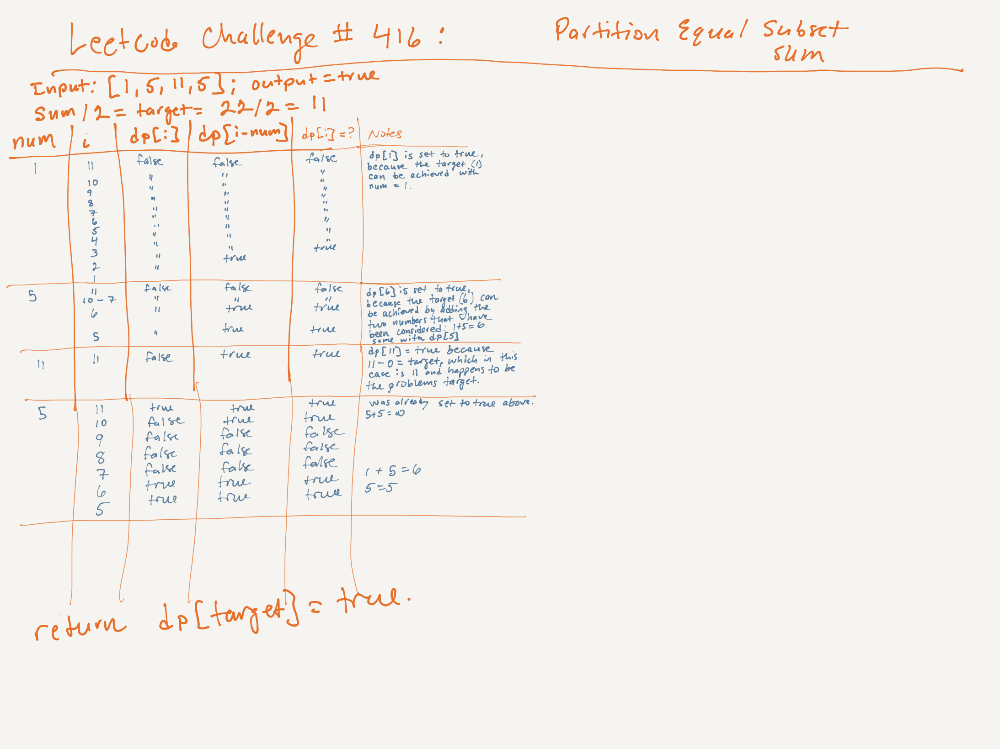

# LeetCod Challenge #416: Partition Equal Subset Sum | Rating: Medium

## Task

Given an array of integers, return true if you can partition the array into two subsets such that the sum of the elements in both subsets is equal or false otherwise.

## Example 1

Input: nums = [1,5,11,5]  
Output: true  
Explanation: The array can be partitioned as [1, 5, 5] and [11].

## Example 2

Input: nums = [1,2,3,5]  
Output: false  
Explanation: The array cannot be partitioned into equal sum subsets.

## Constraints

- 1 <= nums.length <= 200
- 1 <= nums[i] <= 100

## Big O

- Time: O(n x target), where n is the size of the input array, and target = totalSum / 2.
- Space: O(target), because a 1-dimensional dynamic-programming array is used.

## Notes

1. Reduce the problem to a subset sum: if the total sum S is even, then both subsets must have a sum of S/2. The problem becomes, “Can we find a subset of the array that adds up to S/2?”.
2. Dynamic programming ensures that all possibilities are explored efficiently without duplicating work.

## Whiteboard

