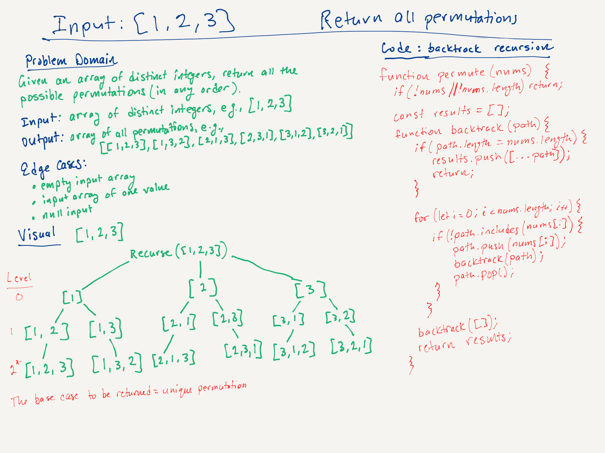

# LeetCode Challenge #46: Permutations | Rating: Medium

Given an array nums of distinct integers, return all the possible permutations. You can return the answer in any order.

## Example 1

Input: nums = [1,2,3]  
Output: [[1,2,3],[1,3,2],[2,1,3],[2,3,1],[3,1,2],[3,2,1]]

## Example 2

Input: nums = [0,1]  
Output: [[0,1],[1,0]]

## Example 3

Input: nums = [1]  
Output: [[1]]

## Constraints

- 1 <= nums.length <= 6
- -10 <= nums[i] <= 10
- All the integers of nums are unique.

## Big 0

- Time: O(n x n!)
  - A permutation rearranges all elements in the input array. For an array of size n, there are n! permutations.Generating all permutations is inherently O(n!) because every arrangement needs to be explored.
  - At each step, the array is checked to find whether the current element under consideration is already extant in the array, and this is O(n).
- Space: O(n * n!)
  - The maximum depth of each recursion is n, so the space required for the stack is O(n).
  - The path array stores up to n elements at any given time, so this also requires O(n) space.
  - n! permutations are generated, and each permutation is an array of size n, so storing all permutations requires O(n * n!) space.

## Whiteboard

