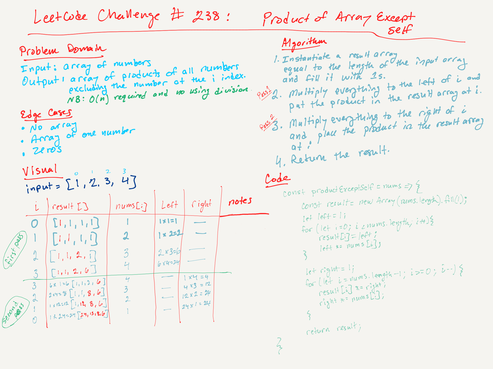

# LeetCode Challenge #238: Product of Array Except Self | Rating: Medium

Given an integer array nums, return an array answer such that answer[i] is equal to the product of all the elements of nums except nums[i].

The product of any prefix or suffix of nums is guaranteed to fit in a 32-bit integer.

You must write an algorithm that runs in O(n) time and without using the division operation.

## Example 1

Input: nums = [1,2,3,4]  
Output: [24,12,8,6]

## Example 2

Input: nums = [-1,1,0,-3,3]  
Output: [0,0,9,0,0]

## Constraints

- 2 <= nums.length <= 105
- -30 <= nums[i] <= 30
- The product of any prefix or suffix of nums is guaranteed to fit in a 32-bit integer.

## Big O

- Time: The two-pass method avoids the need for division and keeps the time complexity at O(n) with constant space complexity (not counting the output array), which is critical for large datasets. It achieves the task without unnecessary complexity by leveraging the multiplicative properties of the numbers.
- Space: O(1), the output array being a given and not counted in auxiliary space.

## Notes

- This solution comes from ChatGPT.
- The core idea is to think about how products can be calculated incrementally and how to avoid including the current index in the multiplication. Understanding that we can compute cumulative products from both ends of the array helps clarify the rationale behind the algorithm.
- Two passes:
  - Left: In the first pass, we compute and store the cumulative product of all elements before the current index. This step builds a foundation for the final product.
  - Right: In the second pass, we modify the previously stored left products by multiplying them with the cumulative product of all elements after the current index. This results in the final output for each index, combining both the left and right contributions.

## Whiteboard

