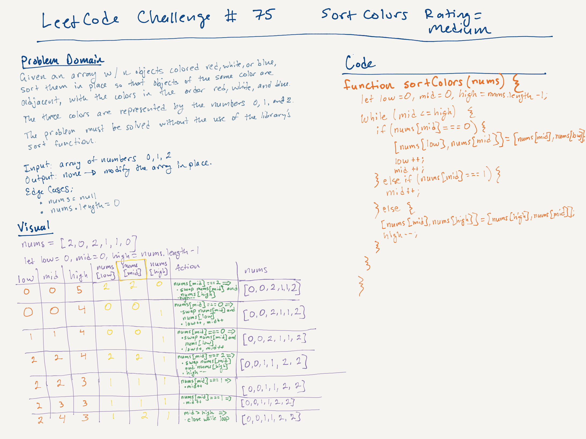

# LeetCode Challenge #75: Sort Colors | Rating: Medium

## Task

Given an array nums with n objects colored red, white, or blue, sort them in-place so that objects of the same color are adjacent, with the colors in the order red, white, and blue.

We will use the integers 0, 1, and 2 to represent the color red, white, and blue, respectively.

You must solve this problem without using the library's sort function.

## Example 1

Input: nums = [2,0,2,1,1,0]  
Output: [0,0,1,1,2,2]

## Example 2

Input: nums = [2,0,1]  
Output: [0,1,2]

## Constraints

- n == nums.length
- 1 <= n <= 300
- nums[i] is either 0, 1, or 2.

## ChatGPT's Algorithm

To solve this problem, use the Dutch National Flag algorithm, which operates in O(n) time complexity and O(1) space complexity. This approach uses three pointers--low, mid, and high--to sort the array in place.

Here is how the algorithm works:

1. Initialize three pointers:
    - low at the start of the array (index 0),
    - mid at the start of the array (index 0),
    - high at the end of the array (index n-1).
2. Iterate through the array:
    - If nums[mid] == 0: Swap nums[low] with nums[mid], and move both low and mid pointers forward.
    - If nums[mid] == 1: Just move the mid pointer forward.
    - If nums[mid] == 2: Swap nums[mid] with nums[high] and move the high pointer backward. Do not move the mid pointer because the swapped element needs to be checked.
3. Stop the process when mid exceeds high.

## Big O

- Time: O(n) because the nums array is traversed exactly once.
- Space: O(1) for the three pointers; the nums array is modified in place.

## Whiteboard

