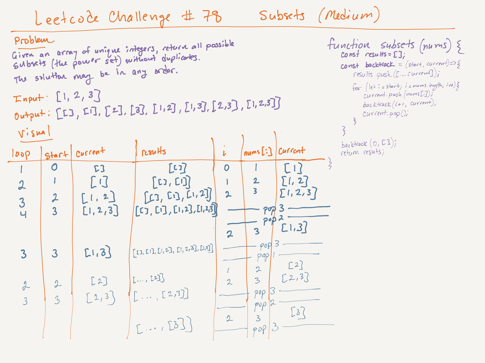

# LeetCode Challenge #78: Subsets | Rating: Medium

## Task

Given an integer array nums of unique elements, return all possible subsets (the power set).

The solution set must not contain duplicate subsets. Return the solution in any order.

## Example 1

Input: nums = [1,2,3]  
Output: [[],[1],[2],[1,2],[3],[1,3],[2,3],[1,2,3]]

## Example 2

Input: nums = [0]
Output: [[],[0]]

## Constraints

- 1 <= nums.length <= 10
- -10 <= nums[i] <= 10
- All the numbers of nums are unique.

## Big O

- Time: O(2^n x n), where n is the number of elements in nums. The 2^n accounts for all subsets, and each subset takes O(n) to copy.
- Space: O(2^n x n) for the results array, while the recursion stack of O(n) is relatively negligible, assuming that the output is considered in the calculation.

## Whiteboard

## Notes

- The collection of all subsets of a set is called the power set, and the size of the power set for a set of n elements is always 2^n.
- If n = 3, the array [a, b, c] has 2^3 = 8 subsets: {}, {a}, {b}, {c}, {a, b}, {a, c}, {b, c}, {a, b, c}.
