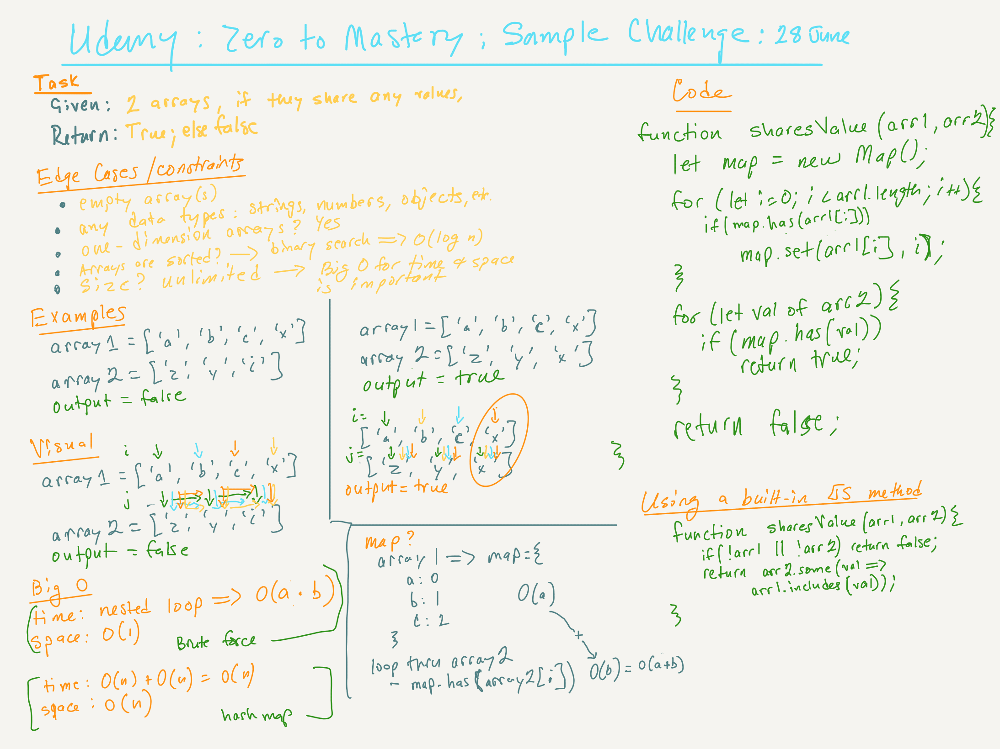

# Udemy: Master the Code Interview, from Zero to Mastery: Data Structures & Algorithms | Determine Whether Two Arrays Share Any Values | Rating: Easy

## Task

Given two arrays, write a function that returns true if the arrays share a value and false if not.

## Constraints

- 0 <= array.length <= Infinity
- The arrays are single dimension
- The values of the arrays may be any type of data: string, boolean, object, or number
- The arrays are not sorted

## Examples

const array1 = ['a', 'b', 'c', 'x'];
const array2 = ['z', 'y', 'i'];
output = false

const array1 = ['a', 'b', 'c', 'x'];
const array3 = ['z', 'y', 'x'];
output = true

## Notes

There are four solutions included in the JS file, each with different virtues.

## Big O

> Solution 1: Brute-force with nested loop
- Time = O(a * b)
- Space = O(1)

> Solution 2: Hashtable using built-in JS class: `const map = Map()`.
- Time = O(a + b)
- Space = O(a)

> Solution 3: Hashtable using `const map = {}`.
- Time = O(a + b)
- Space = O(n)

> Solution 4: Using built-in JS Methods of .some() and .includes()
- Time = O(a + b)
- Space = O(1)

## 
