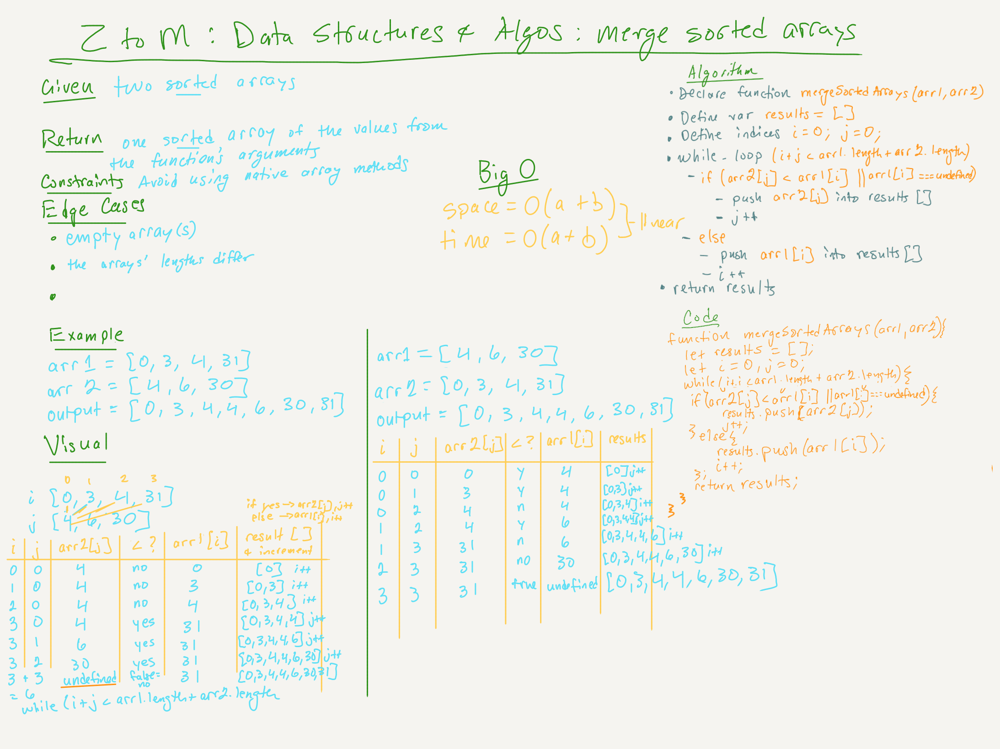

# Udemy: Master the Code Interview, from Zero to Mastery: Data Structures & Algorithms | Merge Two Sorted Arrays | Rating: Easy

## Task

Given two sorted arrays, merge them into one sorted array.

## Example

> input:  
[0, 3, 4, 31];  
[4, 6, 30];  

> output:  
[0, 3, 4, 4, 6, 30, 31]

## Big O

- space = O(a + b)
- time = O(a + b)

## 
